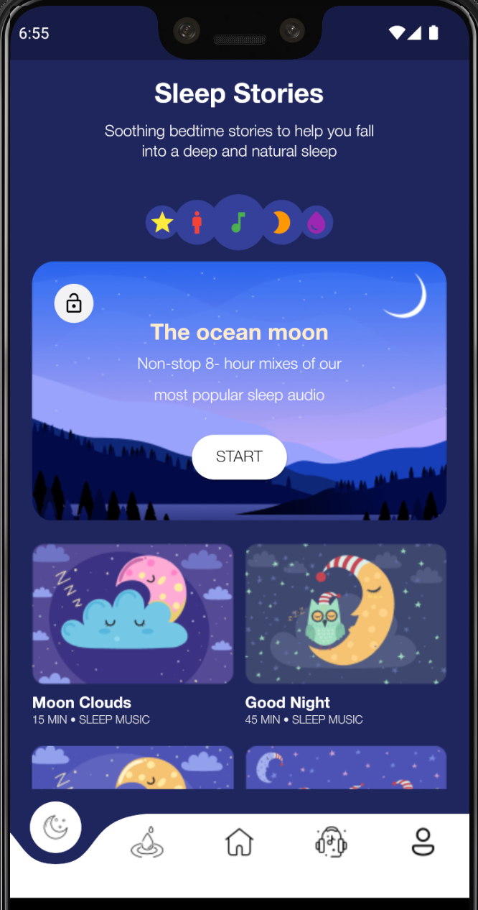
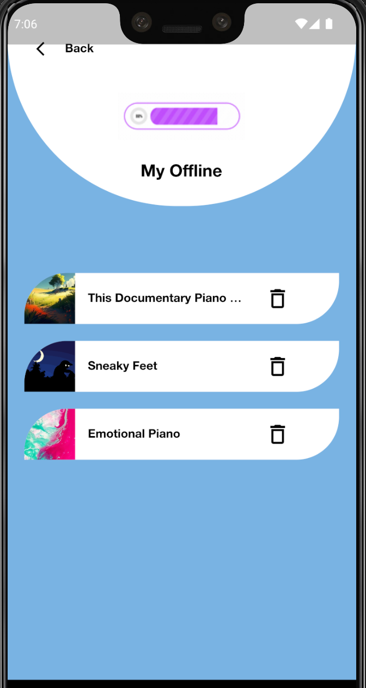
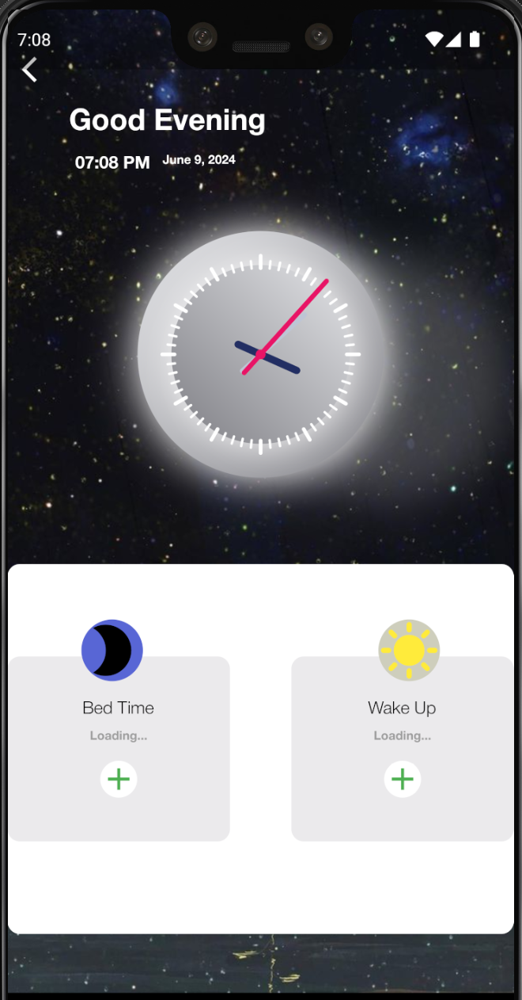
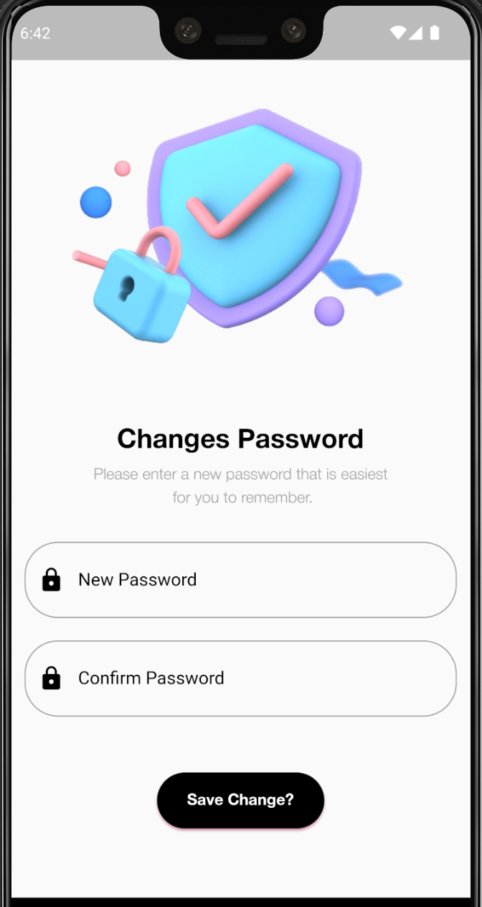

# APP MEDITATE
In building the Meditate application, the main goal is to create a platform to support users in mental training and improving health through meditation. This app offers a variety of guided meditations, suitable for many levels from beginners to experienced people. Users can choose meditations based on duration and goals such as reducing stress, improving sleep, or increasing concentration. In addition, the app also integrates features such as daily meditation reminders, progress tracking, and a community for users to share experiences and encourage each other. A simple, user-friendly interface and high-quality sound are important factors that help users have the most profound and effective meditation experience.


## Authors
- [Quan Văn Mạnh](https://github.com/Manh-IT-K2)

## Project Description:
Meditation application is built with functions including register/login, change password, forgot password, log in with facebook/google, listen to meditation music, edit personal information, change language,...
## Tech Stack Used:
```bash
    * Dart
    * Firebase
```
## Main features of the application:
```bash
1. Register:
    - User fills in information: username, password.
    - Note that the password must be from 8 - 16 characters, which must include 1 uppercase letter, 1 number, 1 lowercase letter and 1 special character.
2. Login:
    - Enter your email and password to log in to the application.
    - Sign in with Google: Select a Google account to sign in.
    - Sign in with Facebook: Select Facebook account to sign in.
Related functions:
    - Forgot password:
      + Enter your registered email or phone or username.
      + The OTP code will be sent to your email/phone to reset your password(username is not needed).
    - Change password:
      + Enter your old password.
      + Enter the new password that needs to be changed and you're done.
3. Play meditate music:
    - Select the song you want to listen to and press play.
    - You can rewind, pause, add to favorites or download.
    - After listening to a song, you will have a streak and it will increase and maintain as you listen regularly.
    - If you don't listen for a day, you will lose the streak.
4. Edit Profile:
    - You can edit your username but can only change it once.
    - Edit full name, email link/phone number, select date of birth
    - Change your avatar and avatar frame.
5. Change Language:
    - Select the language you want to change including English, French, Chinese, Thai, French, Korean, Vietnamese
```

## Dependencies used in the project
```bash
  ## FIREBASE PACKAGE
    - firebase_core: ^2.8.0
    - firebase_auth: ^4.3.0
    - cloud_firestore: ^4.5.0
  ## STATE MANAGEMENT
    - get: ^4.6.5
  ## DayTime
    - intl: ^0.18.0
  ## OTP TEXTFIELD PACKAGE
    - flutter_otp_text_field: ^1.1.1
  ## Send OTP Email
    - mailer: ^6.0.1
  ## Sign in google
    - google_sign_in: ^6.1.0
  ## Sign in facebook 
    - flutter_facebook_auth: ^5.0.9
  ## Savechage login
    - shared_preferences: ^2.1.1
  ## Rotation
    - flutter_spinkit: ^5.2.0
  ## Chose image library
    - image_cropper: ^3.0.1
    - image_picker: ^0.8.5+3
    - permission_handler: ^10.3.0
  ## Download link music http
    - dio: ^5.2.1+1
  ## File storage
    - path_provider: ^2.0.15
  ## Image gif
    - gif_view: ^0.3.1
  ## Connection internet
    - connectivity_plus: ^4.0.1
  ## Delete app
    - firebase_analytics: ^10.4.3
  ## Check image when error internet
    - cached_network_image: ^3.2.3
  ## Notification
    - flutter_local_notifications: ^14.1.1
```

## [Project Demo Link]()
## Application interface:

| Introduce | Sign Up | Sign In | Welcome |
|:---------:|:-------:|:-------:|:-------:|
|  |  |  |  |

| Home | Meditate | Sleep Stories | User |
|:----:|:--------:|:-------------:|:----:|
|  |  |  |  |

| Music Chill | Play Music | Detail Meditate | Detail Sleep |
|:-----------:|:----------:|:---------------:|:------------:|
|  |  |  |  |

| Setting | Be Premium | My Favourite | My Offline |
|:-------:|:----------:|:------------:|:----------:|
|  |  |  |  |

| Edit Profile | Edit Avatar | Chose Time Alarm | Alarm |
|:------------:|:-----------:|:---------------:|:------:|
|  |  |  |  |

| Chose Topic | Time Notify Turn App | Podcast English | Music Relaxation |
|:-----------:|:--------------------:|:---------------:|:----------------:|
|  |  |  |  |

| Change Password Use Forgot| Change Password | Veryfi Code | Change Language |
|:-------------------------:|:---------------:|:-----------:|:---------------:|
|  |  |  |  |

| Forgot Password | Fogot Password Use Email | Fogot Password Use Phone | Fogot Password Use Username |
|:---------------:|:------------------------:|:------------------------:|:---------------------------:|
|  |  |  |  |


### Make sure to star the repository if you find it helpful!
<a href="https://github.com/Manh-IT-K2/AppMeditate/stargazers"></a>

